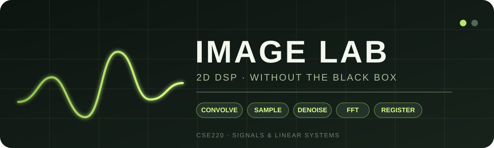
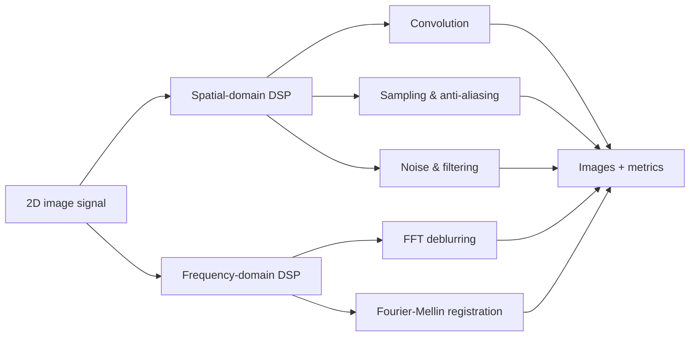
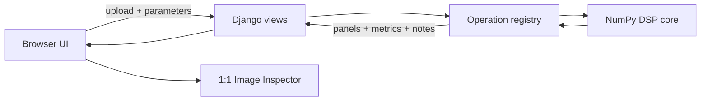

<!-- Image Lab · CSE220 Signals & Linear Systems -->

<p align="center">
  
</p>

<p align="center">
  <strong>See what image-processing libraries usually hide.</strong><br/>
  A hands-on 2D digital signal processing laboratory built from the defining equations with Python and NumPy.
</p>

<p align="center">
  
  
  
  
  <a href="https://cse-220-project.vercel.app/"></a>
</p>

<p align="center">
  <a href="#-the-lab">The Lab</a> ·
  <a href="#-experiments">Experiments</a> ·
  <a href="#-how-it-is-built">Architecture</a> ·
  <a href="#-run-locally">Run Locally</a> ·
  <a href="#-project-structure">Project Structure</a>
</p>

---

## Why Image Lab?

Most image-processing libraries can blur, resize, denoise, deblur, or register an image with a single function call. That is useful in production, but it hides the signal-processing steps we wanted to study.

**Image Lab** takes the opposite approach. The core operations are implemented from their DSP definitions using **NumPy**, while Django provides a lightweight interactive interface. The goal is not to replace OpenCV; it is to make the mathematics behind common image operations visible and testable.

Upload an image, choose an experiment, change the parameters, and compare the result with the original. Alongside the images, the interface exposes useful measurements, difference views, frequency-domain visualizations, and explanations of what changed.

> **Design rule:** the DSP core does not call OpenCV or SciPy image-processing routines. Convolution, interpolation, anti-alias filtering, noise models, restoration, FFT deblurring, log-polar sampling, and phase correlation are implemented directly with NumPy.

---

## 🧪 The Lab

The application is organized as five experiments that move from spatial-domain filtering to frequency-domain restoration and registration.

| # | Experiment | What you can investigate | Main CSE220 ideas |
|---|---|---|---|
| 01 | **Convolution** | Editable kernels, blur/sharpen/edges, normalization, boundary extension | 2D signals, LTI systems, convolution, impulse response |
| 02 | **Resize & Anti-alias** | Downsample with and without a Gaussian prefilter; nearest vs bilinear | Sampling theorem, Nyquist limit, aliasing, interpolation, low-pass filtering |
| 03 | **Noise & Cleaning** | Gaussian or salt-and-pepper noise; mean, median, Gaussian cleaning | Noise models, smoothing, linear vs nonlinear filtering, signal quality |
| 04 | **FFT Deblur** | Motion blur, direct inverse filtering, Wiener restoration | DFT/FFT, convolution theorem, frequency response, inverse systems |
| 05 | **Spectral Match** | Recover rotation, scale and translation between related images | Fourier magnitude/phase, log-polar mapping, phase correlation |

Every result image can also be opened in the **Image Inspector** at its actual exported resolution, zoomed/panned, fitted to the screen, and downloaded as PNG. This is especially useful for resize experiments where equal-sized preview cards would otherwise hide the true sampling resolution.

---

## 🔬 Experiments

### 01 · Convolution — build the filter yourself

An editable kernel is slid across the image using the 2D convolution sum. The lab supports **zero, reflect, edge, and wrap** boundary extensions and reports the kernel sum (DC gain), raw output range, clipping, MSE, PSNR, and compute time.

**g[m,n] = Σₖ Σₗ f[k,l] h[m-k,n-l]**

The experiment makes it easy to compare smoothing kernels, sharpening kernels, and zero-sum edge detectors instead of treating them as unrelated image effects.

### 02 · Resize & Anti-alias — sampling is the real problem

When an image is reduced, the sampling grid becomes coarser and the new Nyquist limit drops. Image Lab produces two paths side by side:

```text
without anti-aliasing:  image ───────────────→ resample
with anti-aliasing:     image → low-pass → resample
```

For downsampling, the anti-aliased path applies a Gaussian prefilter before interpolation. The interface reports source/target dimensions, scale, decimation factor, prefilter sigma, alias energy, MSE, and PSNR. The downloadable result keeps the real reduced dimensions even though the comparison preview is enlarged for visibility.

### 03 · Noise & Cleaning — match the filter to the corruption

The clean upload is deliberately corrupted with either **additive Gaussian noise** or **salt-and-pepper impulse noise**. It can then be cleaned with a moving-average, median, or Gaussian filter.

Because the original image is known, the experiment can compare the noisy and restored images using **MSE, PSNR, and SSIM**. A residual image shows where restoration changed the reference. A fixed random seed keeps the same noise realization while filter parameters are adjusted, making comparisons fair.

This also exposes an important distinction: mean/Gaussian smoothing is linear filtering, while the median is an order-statistic, nonlinear filter that is particularly effective against impulse outliers.

### 04 · FFT Deblur — reverse a known blur, carefully

Motion blur is modeled as convolution with a point-spread function (PSF):

**g = f * h + n**

The 2D DFT turns convolution into multiplication:

**G(u,v) = H(u,v)F(u,v) + N(u,v)**

Image Lab compares **direct inverse filtering** with a regularized **Wiener/Tikhonov-style restoration**:

**F̂(u,v) = G(u,v)H*(u,v) / (|H(u,v)|² + K)**

The direct inverse demonstrates why dividing by very small values of $H$ amplifies noise. The Wiener result trades perfect inversion for stability. The interface also visualizes the centered log-magnitude of the blur transfer function $|H(u,v)|$.

Two modes are provided:

- **Simulate blur, then restore** — creates a controlled motion-blur/noise experiment from the clean upload, so PSNR and SSIM can be measured.
- **Deblur uploaded image** — treats the upload as the already-blurred observation. Motion length and angle are supplied by the user, making this **non-blind deconvolution**.

### 05 · Spectral Match — registration through the spectrum

Spectral Match estimates a similarity transform between related images:

- in-plane rotation,
- uniform scale,
- horizontal translation,
- vertical translation.

The pipeline uses the **Fourier–Mellin** idea:

```text
reference + query
       ↓
2D FFT magnitude
       ↓
log-polar resampling
       ↓
phase correlation ──→ rotation + scale
       ↓
undo rotation/scale
       ↓
phase correlation ──→ translation
       ↓
registered query
```

Translation changes Fourier phase but not magnitude, so FFT magnitude lets the first stage focus on rotation and scale. In log-polar coordinates, rotation becomes an angular shift and uniform scaling becomes a shift along log-radius. Phase correlation finds those shifts. A second phase-correlation pass then recovers translation.

The implementation also includes optional Hann windowing, parabolic subpixel peak refinement, 180° Fourier-magnitude ambiguity handling, PSR/peak-ratio measurements, overlap metrics, overlay/checkerboard views, and a difference image.

**Controlled mode** generates a known transform and compares the estimate against ground truth. **Two-image mode** registers two uploaded views of substantially the same planar content.

---

## 🧭 From course concept to visible result



The project intentionally connects the experiments instead of presenting five isolated effects: convolution describes an LTI image system, sampling explains resize artifacts, filtering addresses noise, the convolution theorem moves restoration into the frequency domain, and Fourier phase/magnitude properties make geometric registration possible.

---

## 🏗️ How it is built



| Layer | Responsibility |
|---|---|
| **Django** | Routing, uploads, experiment requests, result responses |
| **NumPy DSP core** | Convolution, kernels, interpolation, FFTs, filtering, metrics |
| **Pillow** | Image file decoding/encoding only |
| **HTML/CSS/JavaScript** | Interactive controls, result grid, inspector, downloads |
| **Operation registry** | Keeps experiment handlers separate from the shared DSP primitives |

There is **no application database** and no migration step. Local uploads/results are runtime files under `media/` and are ignored by Git.

### Implementation map

- `image_lab/dsp_utils.py` — shared numerical DSP primitives and quality metrics.
- `image_lab/operations.py` — convolution, resize/anti-alias, and noise experiments.
- `image_lab/restoration.py` — FFT motion-deblur experiment.
- `image_lab/spectral_match.py` — Fourier-Mellin registration and phase correlation.
- `image_lab/imaging.py` — image loading, normalization, encoding, and storage helpers.
- `image_lab/views.py` — web request/response layer.
- `static/image_lab/` — frontend styling and interaction.
- `image_lab/templates/image_lab/` — Django templates.

---

## 🚀 Run locally

### Requirements

- **Python 3.10+**
- `pip`
- A modern browser
- Git is optional if you download the repository as a ZIP

The Python dependencies are intentionally small: Django, NumPy, Pillow, plus the Vercel runtime helper used by the hosted build. Local execution does not require a database, OpenCV, SciPy, Node.js, or Vercel configuration.

### 1 · Get the source

```bash
git clone https://github.com/shamsulhaquesami01/CSE220_Project.git
cd CSE220_Project
```

Or choose **Code → Download ZIP** on GitHub, extract it, and open a terminal in the extracted folder.

### 2 · Create a virtual environment

**Windows — Command Prompt**

```bat
python -m venv .venv
.venv\Scripts\activate
```

If `python` is not recognized but the Python launcher is installed, replace it with `py`.

**macOS / Linux**

```bash
python3 -m venv .venv
source .venv/bin/activate
```

### 3 · Install dependencies

```bash
python -m pip install --upgrade pip
python -m pip install -r requirements.txt
```

On macOS/Linux, `python3 -m pip` may be used instead.

### 4 · Start Image Lab

```bash
python manage.py runserver
```

Then open **http://127.0.0.1:8000/**.

No database setup or migration command is required.

---

## ✅ Verify the installation

Run Django's system check:

```bash
python manage.py check
```

Run the project test suite:

```bash
python manage.py test image_lab
```

Focused suites are also available:

```bash
python manage.py test image_lab.test_restoration
python manage.py test image_lab.test_spectral_match
```

---

## 🎛️ Suggested demo path

For a quick tour of the whole project:

1. **Convolution:** choose a blur, sharpen, or edge kernel and change the boundary mode.
2. **Resize & Anti-alias:** downsample a detailed image and compare the aliased and prefiltered paths.
3. **Noise & Cleaning:** try salt-and-pepper + median, then Gaussian noise + Gaussian/mean filtering.
4. **FFT Deblur:** use simulation mode first so direct inverse and Wiener restoration can be compared against a known reference.
5. **Spectral Match:** start with controlled mode, then try two transformed versions of the same poster/document/object.
6. Click any result to open the **Image Inspector** and verify its true exported dimensions.

---

## 📁 Project structure

```text
CSE220_Project/
├── README.md
├── LICENSE
├── requirements.txt
├── manage.py
├── config/                         # Django project configuration
│   ├── settings.py
│   ├── urls.py
│   ├── asgi.py
│   └── wsgi.py
├── image_lab/                      # Application + DSP implementation
│   ├── dsp_utils.py
│   ├── operations.py
│   ├── restoration.py
│   ├── spectral_match.py
│   ├── imaging.py
│   ├── views.py
│   ├── tests.py
│   └── templates/image_lab/
├── static/image_lab/
│   ├── css/style.css
│   └── js/
│       ├── app.js
│       └── image-inspector.js
├── browser_tests/
│   └── inspector.cjs
└── assets/
    └── banner.svg
```

Runtime-only folders such as `.venv/`, `media/`, `staticfiles/`, caches, and local secret keys are excluded through `.gitignore`.

---

## 📏 Scope and limitations

Image Lab is an educational DSP platform, so the algorithms favor visibility and direct implementation over the breadth and optimization of a production computer-vision library.

- Uploaded images are limited/resized for responsive interactive experiments.
- Median filtering and custom NumPy operations are not intended to outperform optimized native CV libraries.
- Uploaded-image deblurring is **non-blind**: the user must estimate motion length and angle.
- Spectral Match assumes substantially the same planar content under rotation, uniform scale, and translation. Strong perspective changes, deforming objects, unrelated images, or very different viewpoints are outside its similarity-transform model.
- Restoration cannot recreate information that a degradation has completely removed; regularization manages the trade-off between recovery and instability.

---

## 👥 Team

**CSE220 — Signals & Linear Systems**

| Student | ID | GitHub |
|---|---:|---|
| **Mehedi Hasan Kanon** | 2305052 | [@mehedihasankanon](https://github.com/mehedihasankanon) |
| **Md Shamsul Haque Sami** | 2305055 | [@shamsulhaquesami01](https://github.com/shamsulhaquesami01) |

This repository contains the complete source code for the course project. The project was developed as an educational implementation of 2D signal-processing concepts; external libraries are used for the web framework, numerical arrays, and image I/O, while the DSP algorithms themselves are implemented in the repository.

---

<p align="center">
  <strong>Image Lab</strong><br/>
  <sub>From pixels → signals → spectra → understanding.</sub>
</p>
